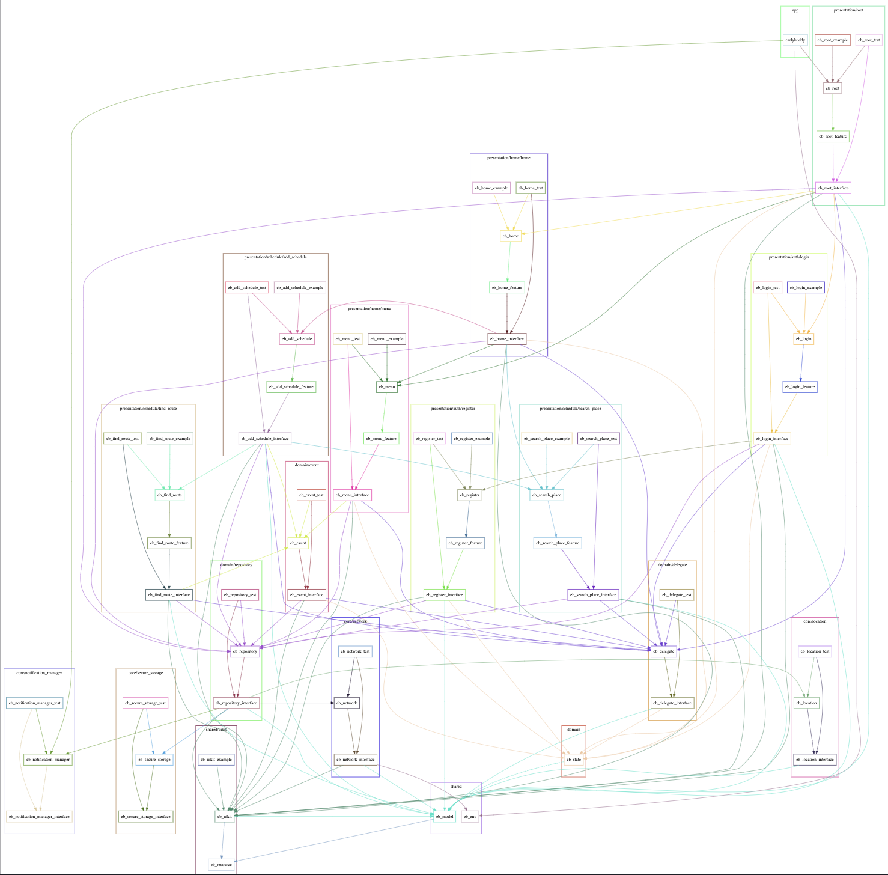

# EarlyBuddy

일정을 관리하고 배차정보를 한눈에 볼 수 있는 앱입니다.

# Flutter

## **Unidirectional Data Flow**

저는 양방향 아키텍쳐 보다는 데이터 흐름이 명확한 단방향 아키텍쳐를 선호합니다. 단방향 아키텍쳐를 설계하기 위해 여러 라이브러리를 비교해본 결과 [Bloc](https://github.com/felangel/bloc) 라이브러리를 사용하기로 했습니다. 공식문서에서 설명하듯 비즈니스 로직과 프레젠테이션 코드를 명확히 분리한다는 느낌을 받았고 커뮤니티에서 많이 사용되는 비교적 성숙한 라이브러리라는 이점도 있었기 때문입니다.

## The Modular Architecture

이전 프로젝트인 [Animated Drawing](https://www.notion.so/Animated-Drawing-a94f8955118848eaaaa50a7ecced8007?pvs=21)에서 모듈화를 진행했습니다. 유지보수 및 전체적인 프로젝트 관리가 수월해졌던 경험이 있어서 이번 프로젝트에도 모듈화를 적용했습니다. 

### **Dependencies Graph**

### 5 Layer

- App : 프로젝트 앱
- Presentation : 뷰와 뷰로직 관련 코드
- Domain : 데이터를 Presentation영역에서 쉽게 사용할 수 있게 가공, Presentation 반복되는 뷰로직 모듈화
- Core : 네트워크, 위치정보, 알림설정, 로컬 데이터베이스와 같이 앱에서 사용될 기능들
- Shared : 프로젝트 내에서 반복적으로 쓰이는 코드 모듈화, 환경변수, 모델과 같이 의존관계에서 가장 최하단에 위치하는 기능들

### Targets

**Presentation Layer**

- Example : 시뮬레이터에서 실행할 수 있는 App 타겟
- Views : 뷰
- Features : 뷰로직, Domain 레이어와 직접 연결
- Tests : 테스트 타겟과 테스트에 사용될 Mock 객체 구현
- Interfaces : 특정 모듈에서만 사용되는 모델, 프로토콜과 같은 추상화된 인터페이스

**Domain, Core Layer**

- Features : 기능 구현
- Tests : 테스트 타겟과 테스트에 사용될 Mock 객체 구현
- Interfaces : 특정 모듈에서만 사용되는 모델, 프로토콜과 같은 추상화된 인터페이스

## 모듈화에 부족한 라이브러리 기능들

모듈간의 의존성은 패키지 관리 라이브러리인 Melos를 사용해 설정했습니다.

템플릿 생성 도구로는 [mason](https://github.com/felangel/mason), [very_good_cli](https://github.com/VeryGoodOpenSource/very_good_cli) 등 여러 라이브러리를 사용해보았으나 모두 시스템 관련 명령어 기능이 부족해 제가 원하는 템플릿을 만들 수 없었습니다. 그래서 파이썬 라이브러리인 [typer](https://typer.tiangolo.com/)를 사용하여 간단한 [cli툴](https://pypi.org/project/tma_flutter/)을 만들어 사용했습니다.
